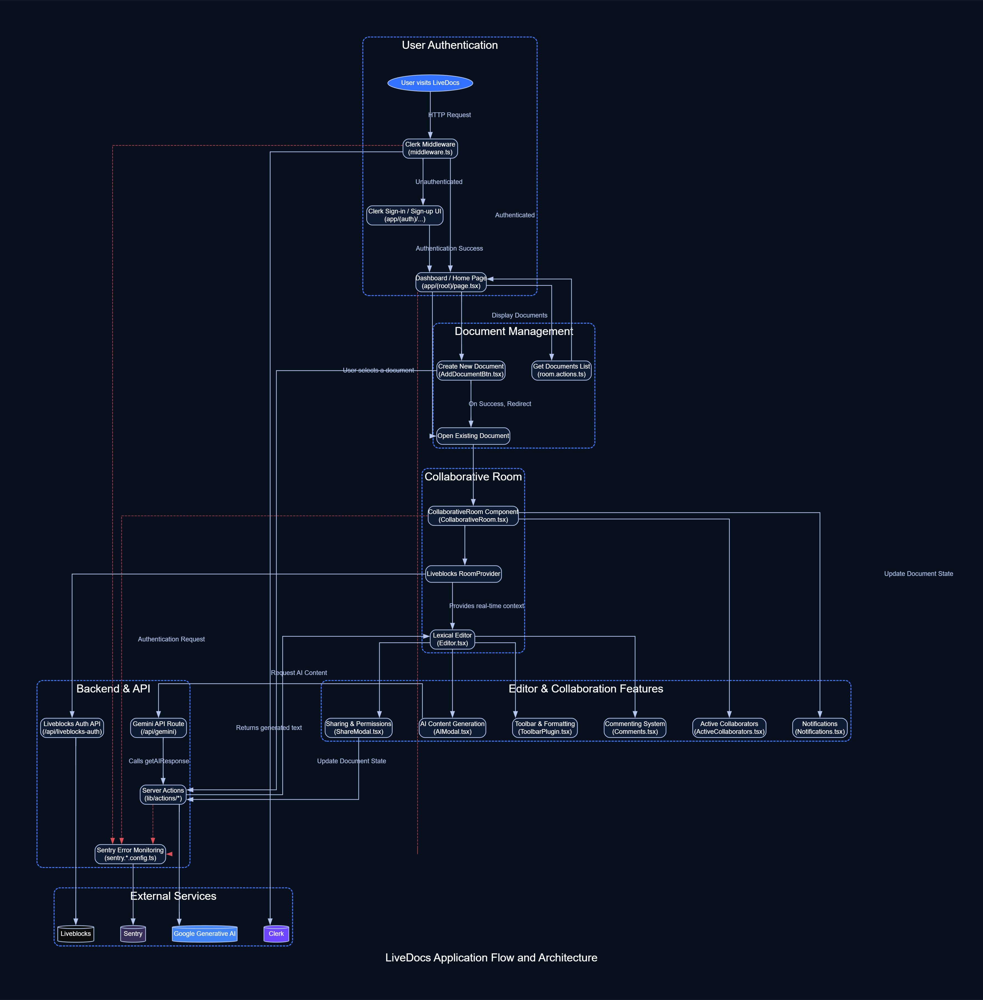

# LiveDocs: Real-Time Collaborative Document Editor
        
        
-----

## Executive Summary

LiveDocs is a high-performance, real-time collaborative document editor engineered to deliver a seamless, Google Docs-like experience. This full-stack application showcases a modern, reactive architecture using Next.js and Liveblocks, enabling multiple users to create, edit, and collaborate on documents simultaneously. The platform integrates a powerful rich-text editor based on the Lexical framework, robust user authentication with Clerk, proactive error monitoring with Sentry, and **AI-powered content generation using Google Generative AI**, resulting in a scalable, user-friendly, and reliable collaborative environment.

-----

### 📌 Live Demo

[🚀 Click here to view the deployed project](https://live-docs-xi-ten.vercel.app/)

-----

### ✨ Features & Technical Implementation

| 🧩 Feature | ⚙️ Technical Implementation |
| :--- | :--- |
| **Real-Time Collaborative Editing** | Leverages **Liveblocks** for real-time data synchronization of editor state between multiple users, including cursor presence and text changes. The `CollaborativeRoom` component manages the Liveblocks `RoomProvider` and `ClientSideSuspense` for a smooth collaborative session. The `Editor` component integrates `LiveblocksPlugin` for real-time features, along with `FloatingComposer` and `FloatingThreads` for interactive UI elements. |
| **Rich-Text Editor & Formatting** | Implements a powerful and extensible text editor using the **Lexical editor framework**. Features a comprehensive toolbar with formatting options like headings, bold, italics, underline, strikethrough, and alignment, managed by `ToolbarPlugin`. A `FloatingToolbarPlugin` provides contextual editing options. |
| **AI-Powered Content Generation** | Integrates **Google Generative AI** (Gemini 1.5 Flash) to assist users with content creation. Users can input a prompt via the `AIModal` component, which sends a request to a Next.js API route (`/api/gemini`) that then calls the `getAIResponse` server action to interact with the AI model and insert the generated text directly into the editor. |
| **User Authentication & Management** | Integrates **Clerk** for secure user authentication, including sign-up and sign-in flows (`app/(auth)/sign-in/[[...sign-in]]/page.tsx`, `app/(auth)/sign-up/[[...sign-up]]/page.tsx`). Middleware (`middleware.ts`) is used to protect routes and manage user sessions, ensuring secure access to documents. User data from Clerk is fetched and managed via `lib/actions/user.actions.ts`. |
| **Document CRUD & Management** | Provides full Create, Read, Update, and Delete (CRUD) functionality for documents. Users can create new documents (`AddDocumentBtn.tsx`), view a list of their documents on the home page (`app/(root)/page.tsx`), update titles (`CollaborativeRoom.tsx`), and delete documents they own (`DeleteModal.tsx`), all handled via Next.js Server Actions in `lib/actions/room.actions.ts`. |
| **Sharing, Permissions & Access Control** | Users can share documents via email and assign roles ("editor" or "viewer") to collaborators to manage permissions. This is implemented through the `ShareModal` component and the `updateDocumentAccess` server action. The `UserTypeSelector` and `Collaborator` components facilitate this functionality. |
| **Real-time Commenting System** | A complete commenting system with real-time updates and threaded conversations, powered by Liveblocks' `useThreads` and `Composer` components, implemented in `Comments.tsx`. |
| **Notifications & User Presence**| In-app notifications for document shares and mentions are handled via **Liveblocks Inbox** (`Notifications.tsx`). The UI displays active collaborators in a document, showing their avatars in real-time using the `ActiveCollaborators` component. |
| **Modern, Responsive Frontend** | Built with **Next.js** and **TypeScript**, styled with **Tailwind CSS** (`tailwind.config.ts`, `app/globals.css`), and utilizing **Shadcn UI** components (`components/ui/`) for a responsive, modern, and consistent component library. |
| **Error Monitoring & Reliability** | Integrates **Sentry** for comprehensive error tracking and performance monitoring on both the client (`sentry.client.config.ts`) and server (`sentry.server.config.ts`, `sentry.edge.config.ts`), ensuring a stable and reliable user experience across the application. Global error handling is configured in `app/global-error.tsx`. |

-----


## 🛠️ Technologies Used

This project is built with a modern, powerful tech stack to deliver a seamless and feature-rich experience.

* **Frontend:**
    * [**Next.js**](https://nextjs.org/): A React framework for building full-stack web applications.
    * [**React**](https://react.dev/): A JavaScript library for building user interfaces.
    * [**TypeScript**](https://www.typescriptlang.org/): A typed superset of JavaScript that enhances code quality and maintainability.
    * [**Tailwind CSS**](https://tailwindcss.com/): A utility-first CSS framework for rapid UI development.
    * [**Shadcn UI**](https://ui.shadcn.com/): A collection of re-usable UI components built with Radix UI and Tailwind CSS.

* **Backend:**
    * [**Next.js**](https://nextjs.org/): Utilized for backend logic through API Routes and Server Actions.

* **Real-time Collaboration:**
    * [**Liveblocks**](https://liveblocks.io/): A set of tools and APIs for adding real-time collaborative experiences to applications.

* **Authentication:**
    * [**Clerk**](https://clerk.com/): A complete user management and authentication solution.

* **AI Integration:**
    * [**Google Generative AI**](https://ai.google.dev/): Powered by the **Gemini 1.5 Flash** model for advanced AI capabilities.

* **Error Monitoring:**
    * [**Sentry**](https://sentry.io/): An open-source error tracking tool that helps developers monitor and fix crashes in real time.

* **Text Editor:**
    * [**Lexical**](https://lexical.dev/): An extensible JavaScript web text-editor framework.

---

## 🏗️ System Architecture

<p align="center">
  
  <br/>
  <em>A high-level overview of the LiveDocs architecture, showing the client-server interaction, component structure, and integration with external services.</em>
</p>

LiveDocs is built on a modern, serverless architecture optimized for performance, scalability, and developer experience. The system is logically structured to separate concerns, from the user interface to the real-time backend services.


```
livedocs/
├── 📁 app/                      # Next.js App Router (Core Application)
│   ├── 📁 (auth)/              # Authentication pages (Clerk)
│   ├── 📁 (root)/              # Main application features (Protected Routes)
│   └── 📁 api/                   # API routes for Liveblocks auth & webhooks, AI generation
├── 📁 components/              # Reusable React components (Shadcn UI & custom)
│   ├── 📁 editor/               # Lexical editor components and plugins
│   └── 📁 ui/                   # Shadcn UI components
├── 📁 lib/                      # Helper functions and client initializations
│   ├── 📁 actions/              # Server-side logic (Next.js Server Actions for rooms, users, AI)
│   └── 📄 liveblocks.ts        # Liveblocks client configuration
├── 📄 middleware.ts             # Authentication and route protection
└── 📄 package.json             # Project dependencies and scripts
```

### Architectural Breakdown

1.  **Client-Side (Frontend)**
    The frontend is a dynamic and responsive single-page application built with **Next.js** and **React**, utilizing the **App Router** paradigm.

      * **UI Components**: The interface is constructed with a combination of custom components and **Shadcn UI**, styled with **Tailwind CSS**, ensuring a consistent and modern aesthetic.
      * **Routing**: Employs a file-based routing system with route groups for clear separation of `(auth)` and `(root)` application sections, managed by `middleware.ts`.

2.  **Server-Side (Backend)**
    The backend leverages a serverless approach with **Next.js Server Actions** and **API Routes**, creating a seamless and efficient integration between the client and server.

      * **Server Actions**: Core business logic, such as document creation, updates, sharing, user fetching, and AI content generation, is encapsulated in Server Actions within `lib/actions/`. This allows for direct, secure client-server communication without the overhead of traditional REST APIs.
      * **API Routes**: Dedicated API routes handle specific functionalities like Liveblocks authentication (`app/api/liveblocks-auth/route.ts`) and AI interaction (`app/api/gemini/route.ts`).
      * **Authentication & Authorization**: User authentication is powered by **Clerk**. A robust middleware (`middleware.ts`) protects application routes and manages user sessions, ensuring secure document access.

3.  **Real-time Collaboration & Data Layer**
    The real-time and data layers are managed by **Liveblocks**, which serves as the backend for collaborative features.

      * **Liveblocks**: Handles all real-time data synchronization, including document content, user presence, and comments. The authentication for Liveblocks is managed through a dedicated API route (`app/api/liveblocks-auth/route.ts`). Document creation, retrieval, and updates interact directly with the Liveblocks API via `lib/actions/room.actions.ts` and `lib/liveblocks.ts`.
      * **Data Persistence**: Liveblocks manages the storage and persistence of document data, ensuring that all collaborative changes are saved reliably.

4.  **External Services**
    LiveDocs integrates with external services to enhance its functionality.

      * **Sentry**: Used for comprehensive error tracking and performance monitoring on both the client and server, ensuring a high-quality user experience. Sentry configuration is split between client-side (`sentry.client.config.ts`), server-side (`sentry.server.config.ts`), and edge environments (`sentry.edge.config.ts`), with dynamic import through `instrumentation.ts`.

-----

## 🚀 Getting Started

To get a local copy up and running, follow these simple steps.

### Prerequisites

Make sure you have the following installed on your machine:

  * [Git](https://git-scm.com/)
  * [Node.js](https://nodejs.org/en) (v18.17.0 or later)
  * [npm](https://www.npmjs.com/) (Node Package Manager)

### Installation

1.  **Clone the repository:**
    ```bash
    git clone https://github.com/AkshayTiwari27/LiveDocs.git
    cd LiveDocs
    ```
2.  **Install NPM packages:**
    ```bash
    npm install
    ```
3.  **Set up environment variables:**
    Create a `.env.local` file in the root of your project and add the necessary environment variables. Refer to the `.env.example` file for the required variables.

### Running the Project

Once the installation and environment variables are set up, you can run the project locally:

```bash
npm run dev
```

Open [http://localhost:3000](https://www.google.com/search?q=http://localhost:3000) in your browser to view the project.

-----

## 🔐 Environment Variables

To run this project locally, create a `.env.local` file in the root directory and add the following variables:

```env
# Clerk Authentication Keys
NEXT_PUBLIC_CLERK_PUBLISHABLE_KEY=your_clerk_publishable_key
CLERK_SECRET_KEY=your_clerk_secret_key

# Clerk Auth Routes (use defaults or customize)
NEXT_PUBLIC_CLERK_SIGN_IN_URL=/sign-in
NEXT_PUBLIC_CLERK_SIGN_UP_URL=/sign-up

# Liveblocks API Keys for Realtime Collaboration
NEXT_PUBLIC_LIVEBLOCKS_PUBLIC_KEY=your_liveblocks_public_key
LIVEBLOCKS_SECRET_KEY=your_liveblocks_secret_key

# Google Generative AI Key for AI Integration
GEMINI_API_KEY=your_gemini_api_key
```

You can obtain these keys by creating an account on [Clerk](https://clerk.com/), [Liveblocks](https://liveblocks.io/), and generating a Google API Key for Gemini.

-----

### 📈 Known Issues & Future Improvements

#### Known Issues
Currently, there are no known issues.

#### Future Improvements
- [ ] Implement a more robust version history for documents.
- [ ] Add support for more complex formatting options, such as tables and images.
- [ ] Introduce a "light/dark mode" for the user interface.
- [ ] Introduce autocompletion feature for the user interface.

-----

## 🤝 Contributing

Contributions are what make the open-source community such an amazing place to learn, inspire, and create. Any contributions you make are **greatly appreciated**.

If you'd like to contribute, please follow these steps:

1.  **Fork the Project**

      * Click the 'Fork' button at the top right of the main repository page.

2.  **Clone Your Fork**

      * Clone the repository to your local machine.
        ```bash
        git clone https://github.com/your-username/your-repo-name.git
        cd your-repo-name
        ```

3.  **Create a New Branch**

      * Create a new branch to work on your feature.
        ```bash
        git checkout -b feature/AmazingFeature
        ```

4.  **Make Your Changes and Commit Them**

      * Make your desired changes to the codebase.
      * Commit your changes with a clear and descriptive commit message.
        ```bash
        git add .
        git commit -m "feat: Add some AmazingFeature"
        ```

5.  **Push to Your Branch**

      * Push your committed changes to your forked repository on GitHub.
        ```bash
        git push origin feature/AmazingFeature
        ```

6.  **Open a Pull Request**

      * Navigate to your forked repository on GitHub and click the "Compare & pull request" button.
      * Provide a clear title and a detailed description of your changes.
      * Submit the pull request for review.

We appreciate your effort in making this project better\! 🙌

-----

## 📜 License

This project is licensed under the **MIT License** – see the [LICENSE](https://www.google.com/search?q=https://github.com/AkshayTiwari27/LiveDocs/blob/main/LICENSE) file for details.
